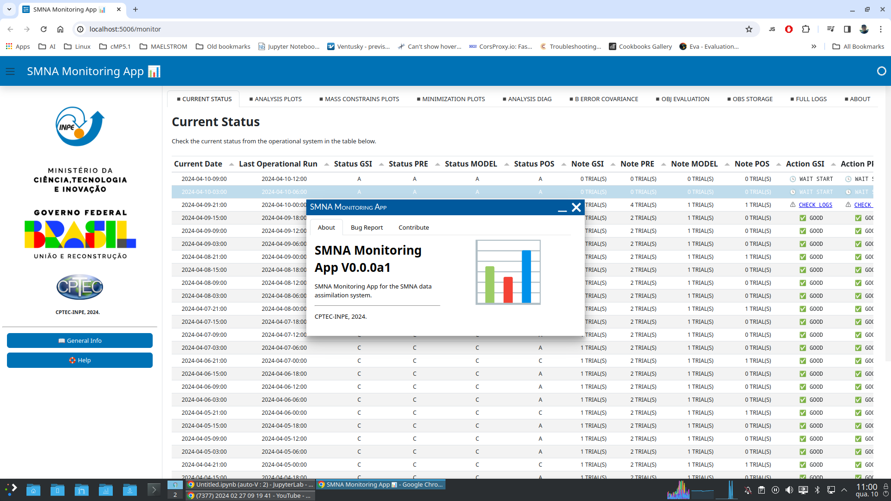

# Utilização

O SMNAMonitoringApp é uma aplicação do tipo dashboard e a sua utilização é feita através do seu navegador de internet. Para abrir uma seção do SMNAMonitoringApp, abra o terminal e digite os comandos:

```linenums="1"
conda activate SMNAMonitoringApp
cd SMNAMonitoringApp
./SMNAMonitoringApp
```

Com isso, o navegador de internet deverá ser carregado e a tela inicial do SMNAMonitoringApp será exibida:



!!! tip "Dica"

    Para uma melhor experiência, pressione a tecla `F11` para fazer o seu navegador entrar em tela cheia.